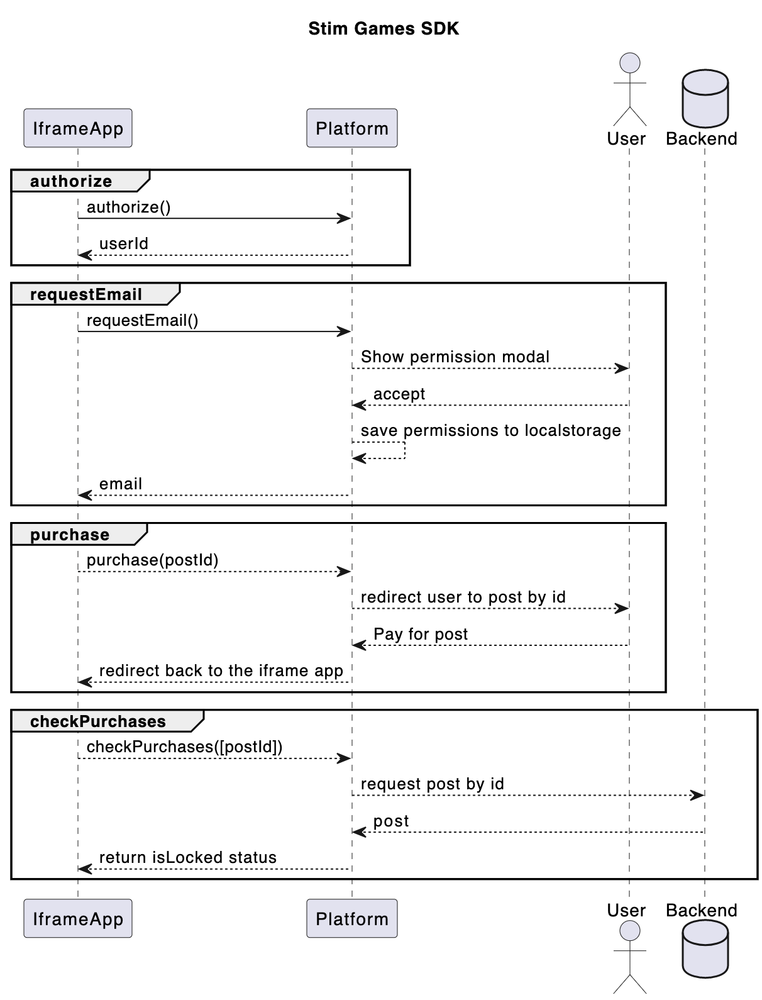

# STIM Games SDK

TypeScript/JavaScript SDK for interaction with games shared on Stim.io

For HTML5 games shared on Stim.io we are rendering games as an iframe and using iframe messages to communicate between your game and the Stim.io platform. In the official "Stim Gaming" iOS app we use a WKWebView. This sdk provides promise based methods to communicate between the Stim platform and your game. Support for Cloud Gaming based games is coming shortly, but the SDK methods will remain the same.

```
npm install games-sdk --save
```

## Methods

### authorize()

This is async method which returns userId or an error if the user has not unlocked your game post. It can be used as DRM to validate that users have paid for your content (unlocked your game post) and to communicate with your games backend. It will return an error if the content is not unlocked.

```
const userId = await gameSDK.authorize()

localStorage.setItem('userId', userId);
```

### requestEmail()

This is async method which prompts the user to agree to share their email, then returns their email or an error if they don't agree to share their email.

```
const email = await gameSDK.requestEmail()
```

### checkPurchases()

This is async method which returns status of paid posts or an error. You can use this to sell in-game items by posting a video of each item, recording it's postID, then checking if the user has unlocked (paid for) that post.

It takes as an argument one or few post ids and returns an object:

```
{
	[postId1]: isLocked,
	[postId2]: isLocked
}
```

```
const email = await gameSDK.checkPurchases(['postId1', 'postId2'])
```

### purchase()

This method redirects user to unlock a post by id

```
gameSDK.purchase('postId1')
```

then user will be able to pay to unlock and on success it will be redirected back to the app. Please, use `checkPurchases` method to check result

```
gameSDK.checkPurchases(['postId1'])
```

## Usage

Please, check our examples folder


